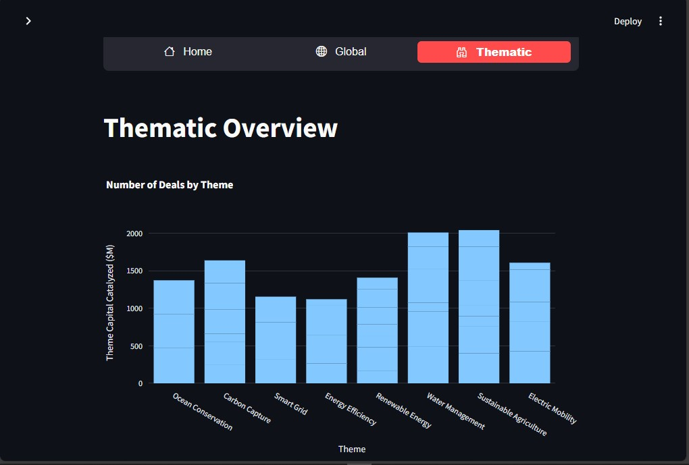

# Global Investment Dashboard

## Project Overview
The **Global Investment Dashboard** is an interactive web application designed to visualize global investment trends and insights. Built with **Streamlit** and **Plotly**, this dashboard enables users to explore company-specific investments, analyze capital commitments by country, and evaluate thematic fund allocations. It serves as an essential tool for analysts and investors looking to gain a deeper understanding of the financial landscape.

## Features
- **Company Hierarchy Visualization**: Display total capital catalyzed, fund investments, and countries funded for selected companies.
- **Global Investment Mapping**: Interactive map showcasing investments by country with detailed hover information.
- **Thematic Analysis**: Visual representation of capital catalyzed by different themes, allowing users to compare trends across various investment themes.
- **Dynamic Data Filtering**: Users can select specific companies to view metrics and visualizations tailored to their needs.

## Technologies Used
- **Python**: Programming language for backend logic and data manipulation.
- **Streamlit**: Framework for creating interactive web applications.
- **Plotly**: Library for creating interactive visualizations.
- **Pandas**: Library for data manipulation and analysis.

## Installation
To run the Global Investment Dashboard locally, follow these steps:

1. Clone the repository:
   ```bash
   git clone https://github.com/kumawatprateek/Global_Investment_Dashboard_Project.git
   cd global-investment-dashboard
   ```

2. Install the required packages:
   ```bash
   pip install -r requirements.txt
   ```

3. Place your data file (e.g., `dummy_sample.csv`) in the root directory of the project.

4. Run the Streamlit application:
   ```bash
   streamlit run Main_app.py
   ```

### Example GUI
<div align="center">
    
</div>

<div align="center">
    
</div>

<div align="center">
    
</div>

<div align="center">
    
</div>

## Usage
- Open your web browser and navigate to `http://localhost:8501` to access the dashboard.
- Use the horizontal menu to navigate between different sections: **Home**, **Global**, and **Thematic**.
- Select a company from the sidebar to view relevant metrics and visualizations.

## Data Sources
The dashboard utilizes a CSV file (`dummy_sample.csv`) that contains investment data, including:
- Company Name
- Fund
- Investment ($M)
- Total Capital Committed ($B)
- Country
- Country Capital Catalyzed ($M)
- Global South Deals Funded
- Theme
- Theme Capital Catalyzed ($M)

## Contributions
Contributions are welcome! If you'd like to contribute, please fork the repository and submit a pull request with your improvements.

## License
This project is licensed under the MIT License - see the [LICENSE](LICENSE) file for details.

## Author
**Prateek Kumawat**  
[LinkedIn](https://www.linkedin.com/in/kumawatprateek/) | [GitHub](https://github.com/kumawatprateek)

## Acknowledgments
- Special thanks to Persist Ventures for providing the opportunity to develop this project.
